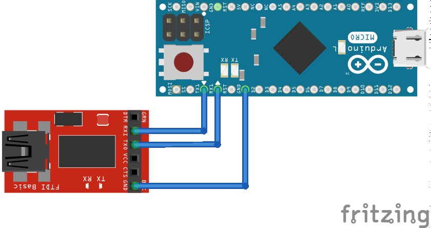

# RubberJogi

## What is the idea / the usecase ?

* You want to control a PC from another PC, making keystrokes, eventually mouse-moves.
* Even when starting up and e.g. entering the BIOS 
* => ssh etc not an option
* you need to be independant from any "client" on the controlled machine
* only solution which comes to mind is : USB HID
* Therefore you connect from PC I somehow to PC II, on PC II as USB-Keyboard

## Solution : RubberJogi

    +----------------+                                  +----------------+
    |                |                                  |                |
    |    PC I        |                                  |    PC II       |
    |                |          +-------------+         |                |
    |  (Controller)  | USB      |             |  USB    |  (Worker)      |
    |                +--------->+ RubberJogi  +-------->+                |
    |                | serial   |             |  HID    |                |
    |                |          +-------------+         |                |
    |                |                                  |                |
    +----------------+                                  +----------------+

* PC I connects to RubberJogi via USB-Serial
* RubberJogi injects Keystrokes etc via USB HID to PC II 

## Incredients Hardware

* Arduino ( with USB-Keyboard capability), e.g. Leonardo, Micro, etc

* USB-TTL UART Converter , FTDI Serial

* some cables

  

  

## Incredients Software 

* As it is not possible to send CMD-Keys like ALT, CTRL via serial line, a language has to be used.
* Avoid to reinvent the wheel ==> Compatible to the famous **RubberDucky**-Script-Language
* ==> Based on arducky by Baptiste MOINE (Creased), THANKS!
* Parser is based on https://github.com/Creased/arducky/blob/master/arducky.ino
* will be extended for also sending MOUSE-Movements
* will be extended to control two additional GPIO-Switches 

## Special Hardware with 2 switches

* we also need to control two switches
* one of these is connected to the reset-button of the PC
* the other one is connected to the switch of a USB-sharing station, so we can switch a USB-stick between PC1 and PC2 ...
* more explanations will follow (including code)
* here at least are the schematics

  

  

